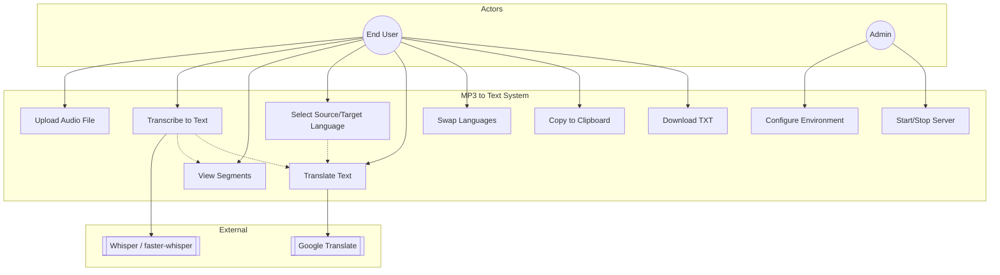

# 06 — Use Case Diagram

## Actors

| Actor | Mô tả |
|-------|--------|
| **End User** | Người dùng web local |
| **Admin** | Cấu hình `.env`, khởi động server |
| **Whisper Model** | Hệ thống con (local STT) |
| **Google Translate** | Hệ thống ngoài (dịch qua internet) |

## Use Case Diagram (Mermaid)

## Danh sách Use Case

| UC ID | Tên | Actor | Mô tả ngắn |
|-------|-----|-------|------------|
| UC-01 | Upload Audio | End User | Chọn/kéo-thả file |
| UC-02 | Transcribe | End User | POST `/api/transcribe` |
| UC-03 | View Segments | End User | Mở details timeline |
| UC-04 | Select Languages | End User | Từ / Sang dropdown |
| UC-05 | Translate | End User | POST `/api/translate` |
| UC-06 | Swap Languages | End User | Đổi chiều ⇄ |
| UC-07 | Copy | End User | Clipboard |
| UC-08 | Download | End User | File `.txt` |
| UC-09 | Configure | Admin | Sửa `.env` |
| UC-10 | Run Server | Admin | `run.ps1` / uvicorn |

## Include / Extend

| Quan hệ | Từ | Đến | Ghi chú |
|---------|-----|-----|---------|
| include | UC-02 | UC-01 | Phải có file trước |
| include | UC-05 | UC-02 | Cần text (thường sau transcribe) |
| extend | UC-05 | UC-04 | Đổi lang kích hoạt dịch lại |
| extend | UC-02 | UC-05 | Nếu `AUTO_TRANSLATE_TARGET` được set |
