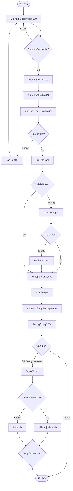
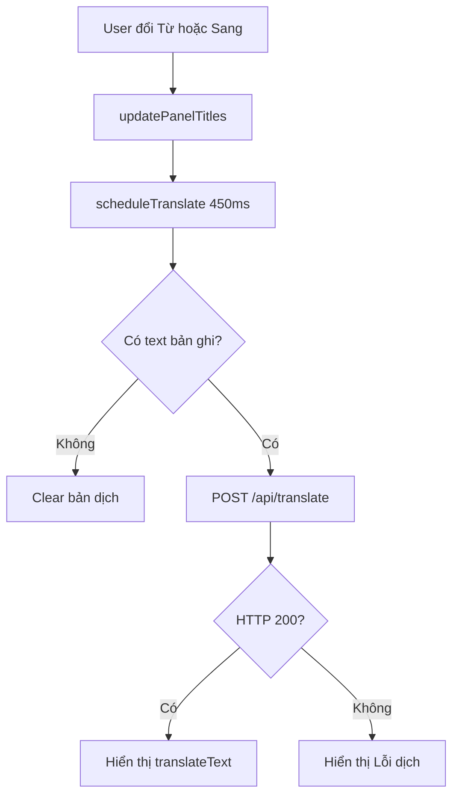
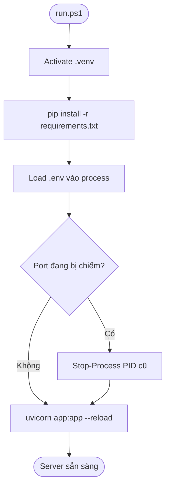

# 07 — Activity Diagram

## 7.1 Luồng chính: Upload → Transcribe → Dịch

```mermaid
flowchart TD
    Start([Bắt đầu]) --> Open[ Mở http://localhost:8000 ]
    Open --> Upload{Chọn / kéo-thả file?}
    Upload -->|Không| Open
    Upload -->|Có| ShowMeta[Hiển thị tên + size]
    ShowMeta --> EnableBtn[Bật nút Chuyển đổi]
    EnableBtn --> ClickTrans[Bấm Bắt đầu chuyển đổi]
    ClickTrans --> Validate{File hợp lệ?}
    Validate -->|Không| Err1[Báo lỗi 400]
    Validate -->|Có| SaveTmp[Lưu file tạm]
    SaveTmp --> LoadModel{Model đã load?}
    LoadModel -->|Không| InitModel[Load Whisper]
    InitModel --> CudaOK{CUDA OK?}
    CudaOK -->|Không| FallbackCPU[Fallback CPU]
    CudaOK -->|Có| Transcribe
    FallbackCPU --> Transcribe[Whisper transcribe]
    LoadModel -->|Có| Transcribe
    Transcribe --> DelTmp[Xóa file tạm]
    DelTmp --> ShowResult[Hiển thị bản ghi + segments]
    ShowResult --> SetSource[Set ngôn ngữ Từ]
    SetSource --> NeedTrans{Cần dịch?}
    NeedTrans -->|Đổi Sang / auto env| CallTrans[Gọi API dịch]
    NeedTrans -->|Không| End([Kết thúc])
    CallTrans --> NetOK{Internet + API OK?}
    NetOK -->|Có| ShowTrans[Hiển thị bản dịch]
    NetOK -->|Không| ErrTrans[Lỗi dịch]
    ShowTrans --> Export{Copy / Download?}
    ErrTrans --> Export
    Export --> End
    Err1 --> Open
```

## 7.2 Luồng đổi ngôn ngữ dịch (debounce)

```mermaid
flowchart TD
    A[User đổi Từ hoặc Sang] --> B[updatePanelTitles]
    B --> C[scheduleTranslate 450ms]
    C --> D{Có text bản ghi?}
    D -->|Không| E[Clear bản dịch]
    D -->|Có| F[POST /api/translate]
    F --> G{HTTP 200?}
    G -->|Có| H[Hiển thị translateText]
    G -->|Không| I[Hiển thị Lỗi dịch]
```

## 7.3 Khởi động server (Admin)

```mermaid
flowchart TD
    S([run.ps1]) --> Venv[Activate .venv]
    Venv --> Pip[pip install -r requirements.txt]
    Pip --> Env[Load .env vào process]
    Env --> Kill{Port đang bị chiếm?}
    Kill -->|Có| Stop[Stop-Process PID cũ]
    Kill -->|Không| Uvi
    Stop --> Uvi[uvicorn app:app --reload]
    Uvi --> Ready([Server sẵn sàng])
```
