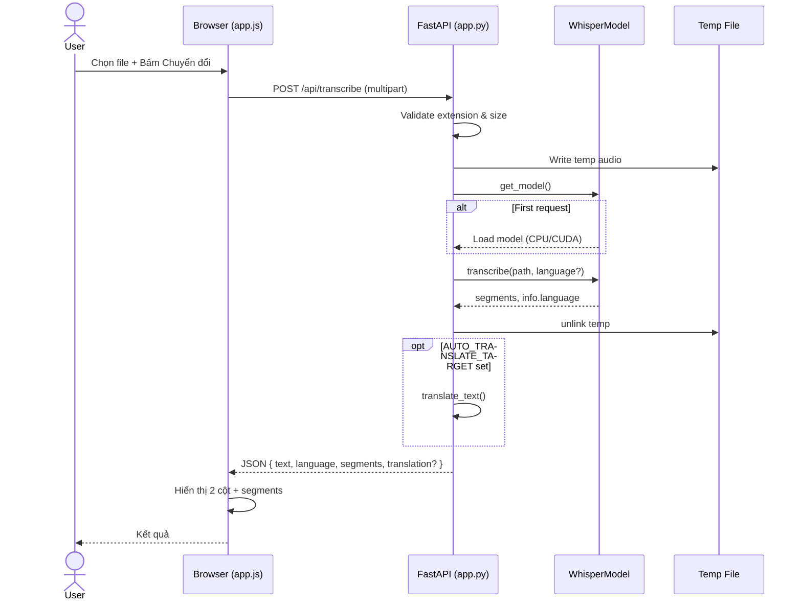
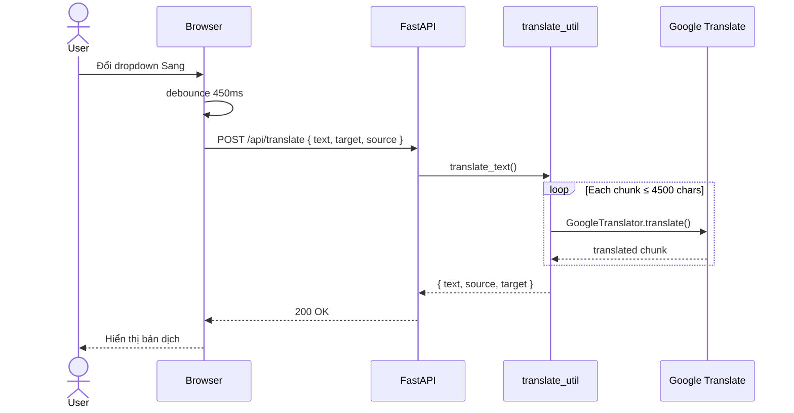
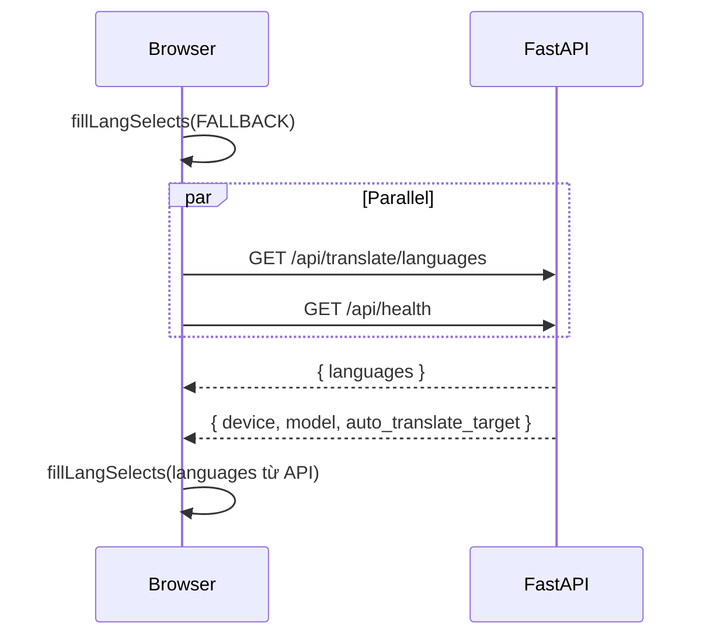
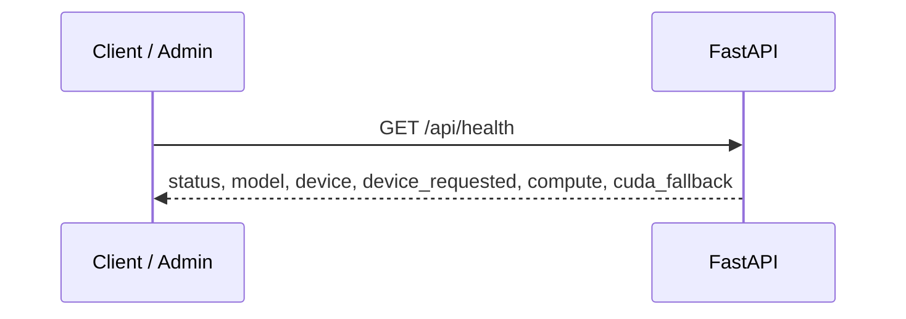

# 08 — Sequence Diagram

## 8.1 Transcribe

```mermaid
sequenceDiagram
    actor U as User
    participant UI as Browser (app.js)
    participant API as FastAPI (app.py)
    participant W as WhisperModel
    participant FS as Temp File

    U->>UI: Chọn file + Bấm Chuyển đổi
    UI->>API: POST /api/transcribe (multipart)
    API->>API: Validate extension & size
    API->>FS: Write temp audio
    API->>W: get_model()
    alt First request
        W-->>API: Load model (CPU/CUDA)
    end
    API->>W: transcribe(path, language?)
    W-->>API: segments, info.language
    API->>FS: unlink temp
    opt AUTO_TRANSLATE_TARGET set
        API->>API: translate_text()
    end
    API-->>UI: JSON { text, language, segments, translation? }
    UI->>UI: Hiển thị 2 cột + segments
    UI-->>U: Kết quả
```

## 8.2 Translate (sau khi đổi ngôn ngữ)

```mermaid
sequenceDiagram
    actor U as User
    participant UI as Browser
    participant API as FastAPI
    participant TU as translate_util
    participant GT as Google Translate

    U->>UI: Đổi dropdown Sang
    UI->>UI: debounce 450ms
    UI->>API: POST /api/translate { text, target, source }
    API->>TU: translate_text()
    loop Each chunk ≤ 4500 chars
        TU->>GT: GoogleTranslator.translate()
        GT-->>TU: translated chunk
    end
    TU-->>API: { text, source, target }
    API-->>UI: 200 OK
    UI-->>U: Hiển thị bản dịch
```

## 8.3 Load languages (trang load)

```mermaid
sequenceDiagram
    participant UI as Browser
    participant API as FastAPI

    UI->>UI: fillLangSelects(FALLBACK)
    par Parallel
        UI->>API: GET /api/translate/languages
        UI->>API: GET /api/health
    end
    API-->>UI: { languages }
    API-->>UI: { device, model, auto_translate_target }
    UI->>UI: fillLangSelects(languages từ API)
```

## 8.4 Health check

```mermaid
sequenceDiagram
    participant Client as Client / Admin
    participant API as FastAPI

    Client->>API: GET /api/health
    API-->>Client: status, model, device, device_requested, compute, cuda_fallback
```
