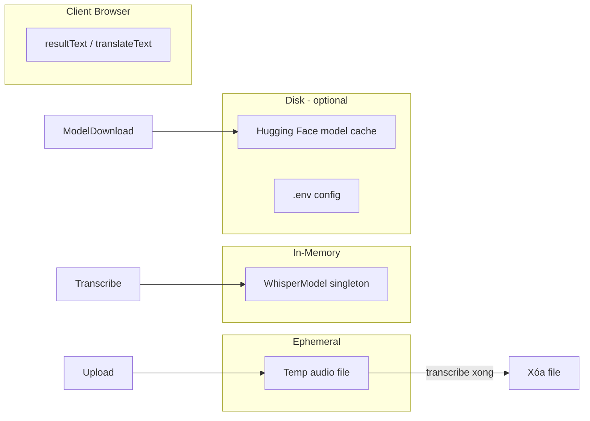

# 11 — Database Design

## 1. Tổng quan

**MP3 → Text v1.0 không sử dụng cơ sở dữ liệu quan hệ hoặc NoSQL.**

Ứng dụng **stateless** theo phiên HTTP: không lưu user, không lưu lịch sử transcribe trên server sau khi request kết thúc.

## 2. Lý do không có DB

| Yếu tố | Quyết định |
|--------|------------|
| Privacy | Audio và text không persist trên server |
| Độ phức tạp | Giảm dependency, triển khai local một máy |
| Use case | Công cụ chuyển đổi ad-hoc, không quản lý dự án |

## 3. Lưu trữ dữ liệu thực tế



| Loại | Vị trí | Vòng đời |
|------|--------|----------|
| File upload tạm | OS temp (`tempfile.NamedTemporaryFile`) | Tạo khi transcribe → xóa trong `finally` |
| Whisper weights | `~/.cache/huggingface/hub/` | Lâu dài, tải lần đầu |
| Cấu hình | `.env` | Thủ công |
| Kết quả | RAM browser (textarea) | Mất khi refresh trang |

## 4. Mô hình dữ liệu logic (Logical)

Nếu mở rộng v2 với database, thự thể gợi ý:

```
┌─────────────┐       ┌──────────────────┐
│    User     │       │  TranscriptionJob │
├─────────────┤       ├──────────────────┤
│ id (PK)     │──1─N─▶│ id (PK)          │
│ email       │       │ user_id (FK)     │
│ created_at  │       │ file_name        │
└─────────────┘       │ source_lang      │
                      │ target_lang      │
                      │ status           │
                      │ transcript_text  │
                      │ translated_text  │
                      │ created_at       │
                      └──────────────────┘
```

**Hiện tại:** không triển khai.

## 5. Cache

| Cache | Công nghệ | Key |
|-------|-----------|-----|
| STT model | Python global `_model` | `WHISPER_MODEL` + device |
| Không cache bản dịch | — | Mỗi request dịch gọi Google mới |

## 6. Backup & retention

- Không có chính sách backup server-side.
- Người dùng tự **Download .txt** nếu cần lưu.

## 7. GDPR / Privacy note

- Audio không lưu trữ cố định trên server ứng dụng.
- Text gửi tới **Google Translate** khi dùng tính năng dịch — tuân theo chính sách Google.
